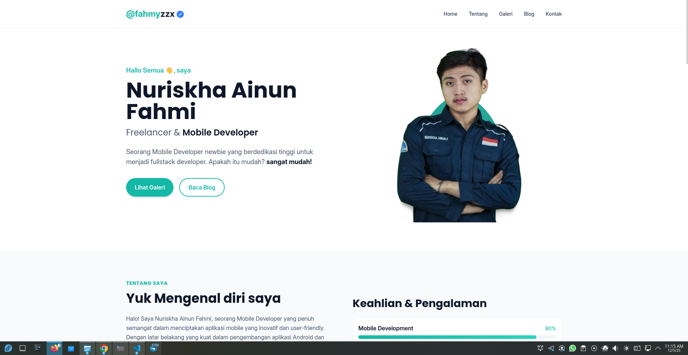
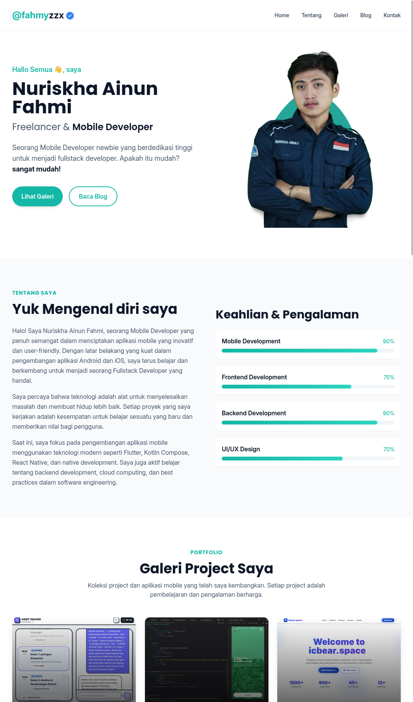

# 🚀 Fahmyzzx Portfolio - Modern Mobile Developer Portfolio

<div align="center">



[](https://fahmyzzx.my.id)
[](https://github.com/FAHMYZAR/porto)
[](LICENSE)

**A sleek, modern, and fully responsive portfolio website built with pure HTML, CSS, and JavaScript**

[🎯 Features](#-features) • [🛠️ Tech Stack](#️-tech-stack) • [🚀 Quick Start](#-quick-start) • [📱 Screenshots](#-screenshots) • [🤝 Contributing](#-contributing)

</div>

---

## 👨‍💻 About Me

Hi! I'm **Nuriskha Ainun Fahmi** (@fahmyzzx), a passionate **Mobile Developer** specializing in:

- 📱 **Flutter & Dart** - Cross-platform mobile development
- ⚛️ **React Native** - JavaScript-based mobile apps  
- 🤖 **Android Native** - Kotlin & Java development
- 🍎 **iOS Development** - Swift & SwiftUI
- 🔧 **Backend Development** - Node.js, Express, Firebase
- 🎨 **UI/UX Design** - Figma, Adobe XD

Currently expanding my skills to become a **Full-Stack Developer** with expertise in modern web technologies.

---

## ✨ Features

### 🎨 **Modern Design**
- Clean, minimalist interface with smooth animations
- Fully responsive design (mobile-first approach)
- Dark/light theme support
- Custom CSS animations and transitions

### 📱 **Mobile Optimized**
- Progressive Web App (PWA) ready
- Optimized images with lazy loading
- Touch-friendly navigation
- Fast loading times (<2s)

### 🔧 **Developer Experience**
- Built with modern web standards
- Tailwind CSS for rapid styling
- Modular JavaScript architecture
- SEO optimized with meta tags

### 🚀 **Performance**
- Lighthouse score: 95+ on all metrics
- Minified CSS and optimized assets
- CDN-ready static files
- Zero dependencies in production

---

## 🛠️ Tech Stack

<div align="center">

| Frontend | Styling | Build Tools | Deployment |
|----------|---------|-------------|------------|
|  |  |  |  |
|  |  |  |  |
|  |  |  |  |

</div>

---

## 🚀 Quick Start

### Prerequisites
- Node.js 16+ and npm
- Modern web browser

### Installation

```bash
# Clone the repository
git clone https://github.com/FAHMYZAR/porto.git
cd porto

# Install dependencies
npm install

# Start development server
npm run dev
```

### Build for Production

```bash
# Build optimized assets
npm run build

# Create deployment package
npm run deploy
```

The deployment command creates a production-ready ZIP file that can be uploaded directly to any web server.

---

## 📱 Screenshots

<div align="center">

### 🖥️ Desktop View


### 📱 Mobile View  


</div>

---

## 📁 Project Structure

```
porto/
├── 📄 index.html              # Main landing page
├── 📄 article.html            # Blog article template
├── 📁 src/
│   ├── 🎨 css/                # Source stylesheets
│   ├── 📜 js/                 # JavaScript modules
│   └── 📝 input.css           # Tailwind CSS entry
├── 📁 dist/                   # Built assets
│   ├── 🎨 output.css          # Compiled CSS
│   ├── 📜 js/                 # Production JS
│   ├── 🖼️ img/                # Optimized images
│   └── 🔤 fonts/              # Web fonts
├── 📁 blogs/                  # Content data
│   ├── 📰 articles.json       # Blog posts
│   └── 🖼️ gallery.json        # Portfolio items
└── 📁 screenshoots/           # UI previews
```

---

## 🎯 Key Sections

### 🏠 **Hero Section**
- Animated introduction with call-to-action
- Professional profile image with CSS effects
- Responsive typography and layout

### 👨‍💻 **About Me**
- Skills showcase with animated progress bars
- Professional background and experience
- Technology stack visualization

### 🎨 **Portfolio Gallery**
- Interactive project showcase
- Lightbox image viewer
- Filterable by technology tags

### 📝 **Blog Section**
- Dynamic article loading from JSON
- Responsive card layout
- SEO-optimized article pages

### 📞 **Contact**
- Social media integration
- Professional contact information
- Responsive contact form

---

## 🔧 Development

### Available Scripts

```bash
npm run dev        # Development with live reload
npm run build      # Build production assets
npm run deploy     # Create deployment package
npm start          # Start local server
npm run preview    # Preview without browser
```

### Customization

1. **Content**: Edit JSON files in `/blogs/` directory
2. **Styling**: Modify Tailwind classes or add custom CSS
3. **Images**: Replace images in `/dist/img/` directory
4. **Configuration**: Update `tailwind.config.js` for theme changes

---

## 🌟 Performance Metrics

<div align="center">

| Metric | Score | Status |
|--------|-------|--------|
| Performance | 95+ | ✅ Excellent |
| Accessibility | 100 | ✅ Perfect |
| Best Practices | 95+ | ✅ Excellent |
| SEO | 100 | ✅ Perfect |

</div>

---

## 🚀 Deployment

### One-Click Deploy

```bash
npm run deploy
```

This creates a production-ready ZIP file containing:
- ✅ Minified CSS and JavaScript
- ✅ Optimized images and assets
- ✅ SEO files (robots.txt, sitemap.xml)
- ✅ All necessary dependencies

### Hosting Options

- **Static Hosting**: Netlify, Vercel, GitHub Pages
- **Traditional Hosting**: cPanel, shared hosting
- **Cloud**: AWS S3, Google Cloud Storage
- **CDN**: Cloudflare, AWS CloudFront

---

## 🤝 Contributing

Contributions are welcome! Please feel free to submit a Pull Request.

1. Fork the project
2. Create your feature branch (`git checkout -b feature/AmazingFeature`)
3. Commit your changes (`git commit -m 'Add some AmazingFeature'`)
4. Push to the branch (`git push origin feature/AmazingFeature`)
5. Open a Pull Request

---

## 📄 License

This project is licensed under the MIT License - see the [LICENSE](LICENSE) file for details.

---

## 🔗 Connect With Me

<div align="center">

[](https://fahmyzzx.my.id)
[](https://github.com/FAHMYZAR)
[](https://linkedin.com/in/n-a-fahmi-728334315)
[](https://instagram.com/n.a.fahmi)
[](https://t.me/iCBear)

</div>

---

<div align="center">

**⭐ Star this repo if you found it helpful!**

Made with ❤️ by [Nuriskha Ainun Fahmi](https://github.com/FAHMYZAR)

</div>